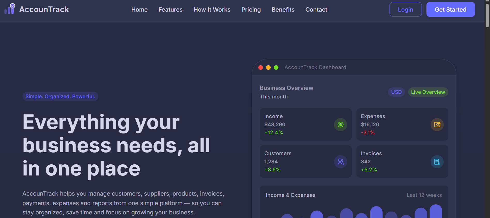
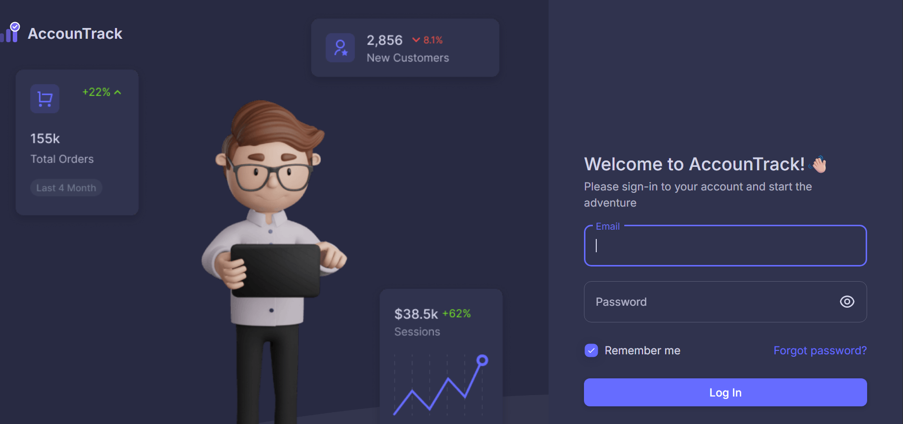
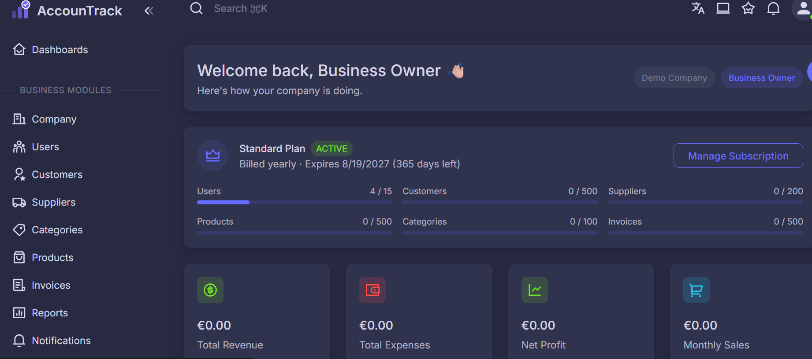
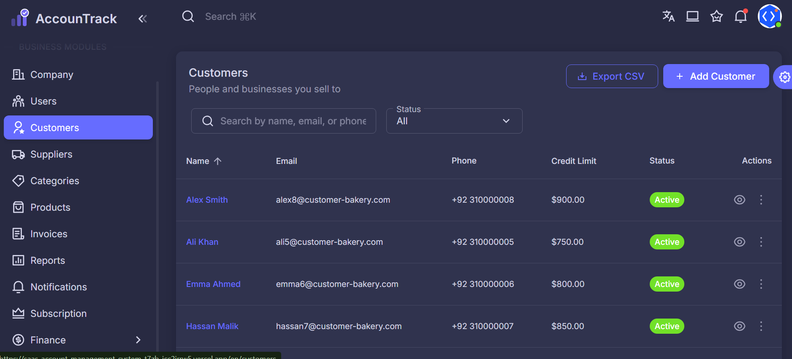
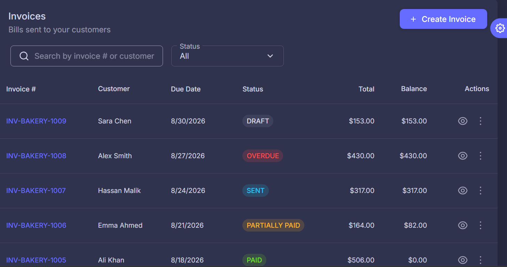
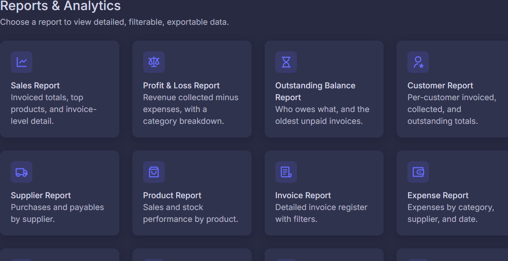
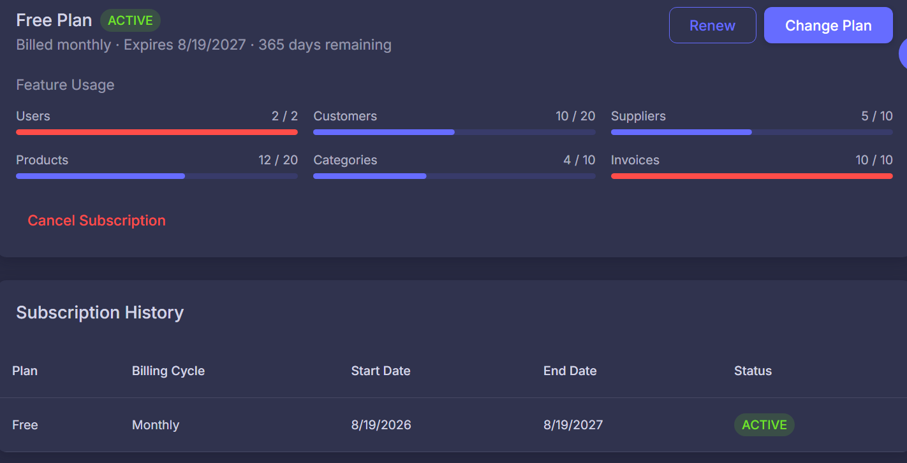

<div align="center">

# 📊 AMS — SaaS Account Management System

**A multi-tenant business management platform** — customers, suppliers, products,
invoices, expenses, income, payments, subscriptions, and reporting, all in one place.



[](#)
[](#)
[](#)
[](#)
[](#)
[](#)
[](#-license)

</div>

---

## 📽️ Demo


> 🚧 Demo video coming soon — see [Screenshots](#-screenshots) below in the meantime.


---

## 📖 Table of Contents

- [Overview](#-overview)
- [Features](#-features)
- [Screenshots](#-screenshots)
- [Tech Stack](#️-tech-stack)
- [Architecture](#️-architecture)
- [Project Structure](#-project-structure)
- [Getting Started](#-getting-started)
  - [Prerequisites](#prerequisites)
  - [1. Clone the repo](#1-clone-the-repo)
  - [2. Backend setup (`server/`)](#2-backend-setup-server)
  - [3. Frontend setup (`client/`)](#3-frontend-setup-client)
  - [4. Run both apps](#4-run-both-apps)
- [Environment Variables](#-environment-variables)
- [Database](#️-database)
- [Available Scripts](#-available-scripts)
- [API Overview](#-api-overview)
- [Roles & Permissions](#-roles--permissions)
- [Reports Module](#-reports-module)
- [Security](#-security)
- [Deployment](#-deployment)
- [Roadmap](#️-roadmap)
- [License](#-license)

---

## 📌 Overview

AMS is a cloud-based, multi-tenant business management platform for small and
medium-sized businesses. Each business runs as an isolated company/tenant on
the same platform, with role-based dashboards for owners, managers,
accountants, and employees — plus a platform-level **Super Admin** area for
managing companies, subscriptions, and plans across the whole SaaS.

This is a two-app repository — an **Express/TypeScript API** in `server/`
and a **Next.js/TypeScript frontend** in `client/` — each with its own
`package.json`, its own `npm install`, and its own dev server. There is no
root-level install; you run each app from inside its own folder (see
[Getting Started](#-getting-started)).

---

## ✨ Features

- 🔐 **Auth** — registration, login, JWT access + refresh tokens, email
  verification, forgot/reset password, invitation-based onboarding
- 🏢 **Multi-tenant company management** — company profile, company settings,
  strict tenant data isolation enforced server-side
- 👥 **User & role management** — Super Admin, Business Owner, Manager,
  Accountant, Employee, with permission checks on both API and UI
- 👤 **Customers** & 🚚 **Suppliers** — full CRUD with contact & transaction info
- 📦 **Products & Categories** — pricing, status, categorization
- 🧾 **Invoices** — line items, customer association, status, payment tracking
- 💰 **Expenses** & 💵 **Income** — categorized records tied to reporting
- 💳 **Payments** — linked to invoices/customers, status tracking
- 🔔 **Notifications** — account, invitation, subscription & system events
- 💳 **Subscriptions & Plans** — plan limits, status, renewal/expiry
  automation (hourly background check)
- 📊 **Role-aware dashboards** — separate dashboard views for Business Owner,
  Manager, Accountant, Employee, and Super Admin
- 📈 **Reports & Analytics** — see the dedicated [Reports Module](#-reports-module)
  section below
- 👑 **Super Admin / platform console** — platform companies, platform users,
  platform revenue, and platform settings, separate from tenant-level data
- ☁️ Cloudinary-backed file uploads, SMTP email delivery

---

## 🖼️ Screenshots

<table>
<tr>
<td width="50%"><br/><sub>Login</sub></td>
<td width="50%"><br/><sub>Business Owner dashboard</sub></td>
</tr>
<tr>
<td width="50%"><br/><sub>Customers</sub></td>
<td width="50%"><br/><sub>Invoice detail</sub></td>
</tr>
<tr>
<td width="50%"><br/><sub>Reports dashboard</sub></td>
<td width="50%"><br/><sub>Subscriptions & plans</sub></td>
</tr>
</table>

---

## 🛠️ Tech Stack

**Frontend** (`client/`)
- Next.js 16 (App Router, Turbopack dev server) + React 19 + TypeScript
- Material UI 7, Materialize admin template foundation
- TanStack Query & TanStack Table, Redux Toolkit
- NextAuth for session handling
- ApexCharts / Recharts, React Hook Form + Valibot, Day.js

**Backend** (`server/`)
- Node.js + Express 5 + TypeScript
- Prisma ORM 6 + MySQL
- JWT auth (access + refresh), bcrypt password hashing
- Nodemailer/SMTP for email, Cloudinary for file storage
- Zod validation, Helmet, express-rate-limit, Morgan logging
- ExcelJS & PDFKit (report export), Multer (uploads)

**Tooling**
- `tsx` for fast TS execution/watch (backend dev, Prisma seeding)
- ESLint + Prettier (frontend), TypeScript project builds on both sides
- Git, npm, Prisma CLI, Postman/Thunder Client

---

## 🏗️ Architecture

```text
                         ┌─────────────────────────┐
                         │        Frontend         │
                         │   Next.js 16 (client/)  │
                         │    React + TypeScript   │
                         └────────────┬────────────┘
                                      │
                                      │ HTTP / REST — /api/v1
                                      ▼
                         ┌─────────────────────────┐
                         │        Backend          │
                         │  Express 5 (server/)    │
                         │       TypeScript        │
                         └────────────┬────────────┘
                                      │
                     ┌────────────────┼────────────────┐
                     │                │                │
                     ▼                ▼                ▼
                ┌─────────┐      ┌──────────┐    ┌───────────┐
                │ Prisma  │      │Cloudinary│    │   SMTP    │
                │   ORM   │      │ Storage  │    │   Email   │
                └────┬────┘      └──────────┘    └───────────┘
                     │
                     ▼
                ┌─────────────┐
                │    MySQL    │
                └─────────────┘
```

Backend request flow: `Routes → Controllers → Services → Repositories → Prisma → MySQL`

---

## 📁 Project Structure

```text
saas-account-management-system/
│
├── client/                      # Next.js frontend — own package.json
│   ├── public/
│   ├── src/
│   │   ├── app/                 # App Router pages, incl. [lang]/(dashboard)/(private)/*
│   │   ├── components/
│   │   ├── data/
│   │   ├── features/            # feature-scoped hooks/types (incl. reports/)
│   │   ├── hooks/
│   │   ├── libs/
│   │   ├── views/                # page-level view components
│   │   └── ...
│   ├── .env.example
│   └── package.json
│
├── server/                      # Express API — own package.json
│   ├── prisma/
│   │   ├── schema.prisma
│   │   ├── migrations/
│   │   └── seed.ts
│   ├── src/
│   │   ├── config/               # env, db, mailer, cloudinary config
│   │   ├── constants/            # roles.ts, permissions.ts
│   │   ├── controllers/
│   │   ├── middlewares/
│   │   ├── repositories/
│   │   ├── routes/
│   │   ├── services/
│   │   ├── templates/            # email templates
│   │   ├── utils/                # incl. dateRange.ts
│   │   ├── validators/
│   │   ├── app.ts                # Express app + route mounting
│   │   └── index.ts              # actual process entrypoint (server start)
│   ├── .env.example
│   └── package.json
│
└── README.md
```

> Note: `server/src/index.ts` — not `app.ts` — is the real entrypoint. `app.ts`
> only builds and exports the configured Express app; `index.ts` starts the
> HTTP listener, verifies the mailer connection on boot, and runs the hourly
> subscription-expiry check.

---

## 🚀 Getting Started

### Prerequisites

- **Node.js 20+** and **npm**
- A running **MySQL** instance (local or hosted)
- (Optional) Cloudinary account — for file/image uploads
- (Optional) SMTP credentials — for verification/reset/invitation emails

This repo has **two independent Node projects**. You'll install and run
`client/` and `server/` separately, each in its own terminal.

### 1. Clone the repo

```bash
git clone <repository-url>
cd saas-account-management-system
```

### 2. Backend setup (`server/`)

```bash
cd server
npm install                     # installs deps
cp .env.example .env            # then fill in the values (see below)
npm run prisma:generate         # generate the Prisma client
npm run prisma:migrate          # apply migrations to your database
npm run prisma:seed             # optional: seed initial data (plans, super admin, etc.)
npm run dev                     # starts the API with tsx watch
```

The API runs on **http://localhost:5000** by default (`PORT` in `.env`).

### 3. Frontend setup (`client/`)

Open a second terminal:

```bash
cd client
npm install                     # installs deps; postinstall auto-builds the icon set
cp .env.example .env.local      # then fill in the values (see below)
npm run dev                     # starts Next.js with --turbopack
```

The frontend runs on **http://localhost:3000** by default.

### 4. Run both apps

Keep both terminals running — the frontend talks to the backend over REST at
`NEXT_PUBLIC_API_URL` (defaults to `http://localhost:5000/api/v1`).

---

## ⚙️ Environment Variables

Never commit `.env`, `.env.local`, or `.env.production`. Copy the `.env.example`
in each app and fill in real values.

### `server/.env`

| Variable | Purpose |
|---|---|
| `NODE_ENV` | `development` \| `production` |
| `PORT` | API port (default `5000`) |
| `DATABASE_URL` | MySQL connection string (used by Prisma) |
| `JWT_ACCESS_SECRET` / `JWT_REFRESH_SECRET` | long random strings, keep secret |
| `JWT_ACCESS_EXPIRES_IN` / `JWT_REFRESH_EXPIRES_IN` | token lifetimes (e.g. `15m` / `30d`) |
| `CORS_ORIGIN` | comma-separated allowed frontend origin(s) |
| `CLOUDINARY_CLOUD_NAME` / `CLOUDINARY_API_KEY` / `CLOUDINARY_API_SECRET` | file uploads |
| `SMTP_HOST` / `SMTP_PORT` / `SMTP_USER` / `SMTP_PASS` / `SMTP_FROM` | outgoing email |

### `client/.env.local`

| Variable | Purpose |
|---|---|
| `BASEPATH` | optional app base path |
| `NEXT_PUBLIC_APP_URL` | public URL of the frontend |
| `NEXTAUTH_URL` / `NEXTAUTH_BASEPATH` / `NEXTAUTH_SECRET` | NextAuth session config |
| `API_URL` / `NEXT_PUBLIC_API_URL` | backend base URL, e.g. `http://localhost:5000/api/v1` |
| `MAPBOX_ACCESS_TOKEN` | Mapbox token, if map features are used |

**Never** expose secret backend values (`DATABASE_URL`, `JWT_*_SECRET`,
`SMTP_PASS`, `CLOUDINARY_API_SECRET`) through `NEXT_PUBLIC_*` variables.

---

## 🗄️ Database

- **MySQL** via **Prisma ORM**
- Schema: `server/prisma/schema.prisma`
- Migrations: `server/prisma/migrations/`
- Seed script: `server/prisma/seed.ts`

```bash
cd server
npm run prisma:generate    # regenerate the client after a schema change
npm run prisma:migrate     # create/apply a dev migration
npm run prisma:studio      # open Prisma Studio (visual DB browser)
npm run prisma:seed        # run the seed script
```

For production, use your platform's non-interactive migration command
(typically `prisma migrate deploy`) rather than `migrate dev`.

---

## 📜 Available Scripts

### `server/` (`npm run <script>`)

| Script | What it does |
|---|---|
| `dev` | Run the API with `tsx watch` (hot reload) |
| `build` | Compile TypeScript (`tsc`) to `dist/` |
| `start` | Run the compiled server (`node dist/index.js`) |
| `prisma:generate` | Generate the Prisma client |
| `prisma:migrate` | Run `prisma migrate dev` |
| `prisma:studio` | Launch Prisma Studio |
| `prisma:seed` | Run `prisma/seed.ts` |

### `client/` (`npm run <script>`)

| Script | What it does |
|---|---|
| `dev` | Run Next.js dev server with Turbopack |
| `build` | Production build |
| `start` | Run the production build |
| `lint` / `lint:fix` | ESLint check / autofix |
| `format` | Prettier format `src/**` |
| `clean` | Remove `.next` |
| `clear` | Remove `.next` and `node_modules` |

---

## 🔌 API Overview

Base URL: `/api/v1`

| Area | Base path |
|---|---|
| Auth | `/api/v1/auth` |
| Companies | `/api/v1/companies` |
| Users | `/api/v1/users` |
| Invitations | `/api/v1/invitations` |
| Categories | `/api/v1/categories` |
| Products | `/api/v1/products` |
| Customers | `/api/v1/customers` |
| Suppliers | `/api/v1/suppliers` |
| Invoices | `/api/v1/invoices` |
| Expenses / Expense categories | `/api/v1/expenses`, `/api/v1/expense-categories` |
| Income / Income categories | `/api/v1/incomes`, `/api/v1/income-categories` |
| Payments | `/api/v1/payments` |
| Plans / Subscriptions | `/api/v1/plans`, `/api/v1/subscriptions` |
| Dashboard | `/api/v1/dashboard` |
| Reports | `/api/v1/reports` |
| Notifications | `/api/v1/notifications` |
| **Platform (Super Admin only)** | `/api/v1/platform/companies`, `/api/v1/platform/users`, `/api/v1/platform/revenue`, `/api/v1/platform/settings` |

All tenant-scoped routes enforce company-level data isolation server-side —
never rely on the frontend alone to restrict access.

---

## 👥 Roles & Permissions

| Role | Scope |
|---|---|
| **Super Admin** | Platform-wide — companies, subscriptions, plans, platform settings |
| **Business Owner** | Full tenant access, including user management |
| **Manager** | Tenant operations, view-only on user management |
| **Accountant** | Financial modules — invoices, expenses, income, reports |
| **Employee** | Restricted, day-to-day operational access |

Permissions are enforced both server-side (route/middleware level) and
reflected in the frontend (sidebar, page guards) so users never see actions
they aren't allowed to perform.

---

## 📈 Reports Module

Reports live under `/reports` in the app and `/api/v1/reports` in the API,
with a shared date-range filter (`dayjs`, including ISO week & quarter
support) via `server/src/utils/dateRange.ts`.

Report types present in this codebase:

- Sales Report
- Profit & Loss Report
- Outstanding Balance Report
- Customer Report
- Invoice Report
- Expense Report
- Income Report
- Payment Report
- Supplier Report
- Product Report
- Tax Report
- Monthly Summary Report

Report export is wired up on the backend (`ExcelJS` + `PDFKit`) via a
dedicated export helper — confirm exact supported formats per report before
publishing this as a finished feature in your public docs.

---

## 🔒 Security

- JWT access + refresh tokens, bcrypt password hashing
- Helmet, CORS restricted via `CORS_ORIGIN`, rate limiting
- Server-side role/permission checks on every protected route
- Tenant isolation enforced at the repository/query level
- Environment-based secrets — nothing sensitive committed to Git
- Email verification, password reset, invitation-based onboarding flows

---

## 📦 Deployment

Recommended split:

```text
client/  → Vercel (set the project root to "client")
server/  → any Node-compatible host (Railway, Render, EC2, etc.)
database → managed MySQL
```

- Set `NEXT_PUBLIC_API_URL` on the frontend to your deployed backend's URL —
  don't hard-code it in source.
- Set `CORS_ORIGIN` on the backend to your deployed frontend's URL.
- Configure all secrets through your hosting platform's environment
  variable settings, never by committing `.env` files.
- Run `prisma migrate deploy` (not `migrate dev`) as part of your deploy step.

---

## 🗺️ Roadmap

- [ ] PDF / Excel / CSV export polish across all report types
- [ ] Interactive analytics charts (revenue/expense/profit trends, KPIs)
- [ ] Print-friendly views for invoices and reports
- [ ] Expanded platform-level analytics for Super Admin

---

## 📜 License

This project is currently maintained as a private/commercial software
project. License terms will be added when the project is prepared for
public distribution.
